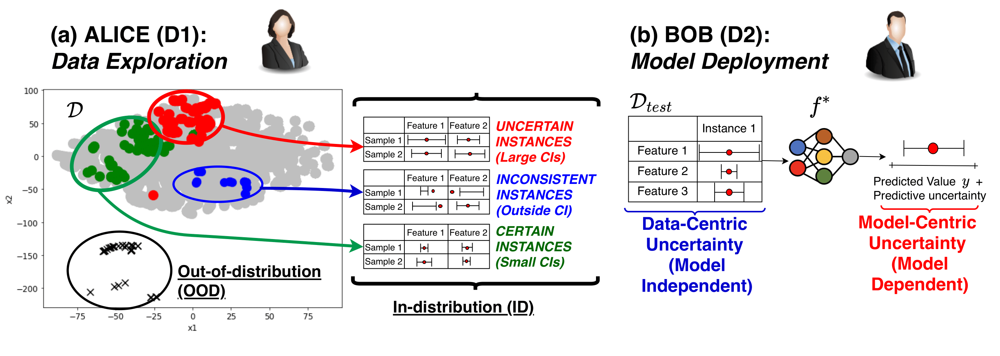
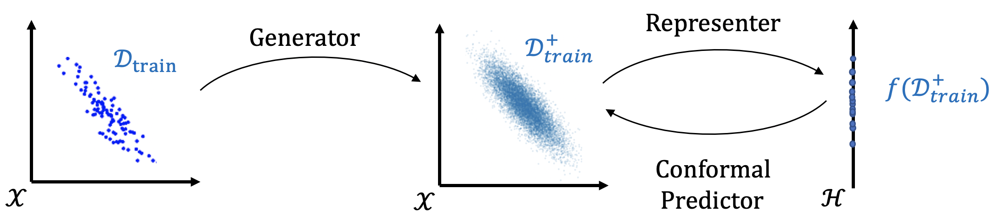

# Data-SUITE: Data-centric identification of in-distribution incongruous examples


This repository contains the implementation of Data-SUITE, a "Data-Centric AI" framework to identify in-distribution incongruous data examples.

DATA-SUITE leverages copula modeling, representation learning, and conformal prediction to build feature-wise confidence interval estimators based on a set of training instances. The copula modeling is optional, but allows a nice property of not needing access to real training data after the initial stages or to augment smaller datasets when needed.

These estimators can be used to evaluate the congruence of test instances with respect to the training set, to answer two practically useful questions:

(1) which test instances will be reliably predicted by a model trained with the training instances?

(2) can we identify incongruous regions of the feature space so that data owners understand the data's limitations or guide future data collection?

For more details, please read our [ICML 2022 paper](https://arxiv.org/abs/2202.08836): 'Data-SUITE: Data-centric identification of in-distribution incongruous examples'.

## Installation
1. Clone the repository
2. Create a new virtual environment with Python 3.7. e.g:
```shell
    virtualenv ds_env
```
3. Run the following command from the repository directory:
 ```shell
pip install -r requirements.txt
 ```

4. Two libraries for benchmarks (alibi-detect and aix360) have conflicting requirements for tensorflow. This can be circumvented by running the below. If this doesn't resolve the issue manually install the two packages in requirements-no-deps.txt using pip.

 ```shell
 pip install --no-deps -r requirements-no-deps.txt
 ```


## Getting started



We provide two tutorial notebooks to illustrate the usage of Data-SUITE, with an example on synthetic data.

These notebooks can be found in the ``/tutorial`` folder.

1. ``tutorial_simple.ipynb``

 - Provides a simple object-oriented (OO) interface to use Data-SUITE with simple fit & predict options.

2. ``tutorial_detailed.ipynb``

- Provides a more detailed look at the inner workings of Data-SUITE.

Both tutorials achieve the same objective, to get started with Data-SUITE.

## Data-SUITE with synthetic & real-data

We also provide code to run Data-SUITE on public datasets. This includes the synthetic data experiments, as well as, the publicly available real-world datasets.

A variety of jupyter notebooks are provided for this purpose. They are contained in the notebooks folder of the repo.

For ease of usage we have provided bash scripts to execute the notebooks via Papermill. The results for all the different experiments/analysis for the datasets are then stored in their specific ``/results`` folder. These include dataframes of metrics, figures, etc.

These bash scripts are contained in the ``/scripts`` folder.

1. Synthetic data:

The synthetic data experiment uses [Weights and Biases - wandb](https://wandb.ai) to log results over the various runs.

Your specific wandb credentials should be added to: ``notebooks/synthetic_pipeline.ipynb``

Thereafter one can run from the main dir:
```shell
bash scripts/synthetic_pipeline.sh
```

Once the experiment has completed all results are logged to wandb. Note this run might take quite some time. One can then download the .csv of logged results from wandb and place it in the ``/artifacts`` folder as ``synthetic_artifacts.csv``.

Since the experiment can take quite long, we have provided an artifact ``synthetic_artifacts.csv`` obtained from wandb.

``synthetic_artifacts.csv`` can then be processed processed to obtain the desired metrics & plots:

For this run from the main dir:

```shell
bash scripts/process_synthetic.sh
```

All results will then be written to ``/results/synthetic``


2. Real data:

To run the public real-world datasets one simply needs to run, for example,  from the main dir:

```shell
bash scripts/run_adult.sh
```

OR

```shell
bash scripts/run_electric.sh
```

All results from the different main paper & appendix experiments will be written to the ``/results`` folder. These include dataframes for tables of metrics, figures, etc.

The real world dataset notebooks can also serve as inspiration for usage on one's own data.


## Citing

If you use this code, please cite the associated paper:

```
@inproceedings
{seedat2022data,
title={Data-SUITE: Data-centric identification of in-distribution incongruous examples},
author={Seedat, Nabeel and Crabbe, Jonathan and van der Schaar, Mihaela},
journal={arXiv preprint arXiv:2202.08836},
year={2022}
}
```
